# StahlTrace · Data Substrate Schema

Visual schema mirroring `src/stahltrace/stahltrace_v6_architecture.pdf` §21
(pages 59–75). Twelve source-of-truth tables plus three auxiliary substrates
(`calibration`, `trace_hierarchy`, `run_log`) and the carried-forward
`aliases` table. Every table joins on `entity_id`; the **trace** is the
primary object — nothing competes with `trace_snapshots` for authority over
trace state (§20).

Supersedes the v4 schema (delta + belief_update ledgers): v5.0 collapsed
those into the single trace primary; v5.1 added the canonical chapter as a
co-equal substrate object; v6 left the substrate unchanged at twelve tables.

Renders natively on GitHub. Edit this file to iterate the design before
promoting changes to a SQL migration.

---

## ER diagram

```mermaid
erDiagram
    entities {
        text entity_id PK
        text lei UK
        text legal_name
        text common_name
        text jurisdiction
        text primary_listing
        enum registration_status
        text parent_entity_id FK
        timestamptz created_at
        timestamptz superseded_at
        text superseded_by FK
        timestamptz gleif_last_synced
        vector1536 semantic_embedding
    }

    aliases {
        text alias_id PK
        text entity_id FK
        enum alias_kind
        text alias_value
        date valid_from
        date valid_to
        text source
        text superseded_by FK
        numeric confidence
    }

    sources {
        text source_id PK
        text source_name
        enum source_tier
        enum source_kind
        text jurisdiction
        enum tenancy_scope
        text tenant_id FK
        numeric base_reliability
        numeric current_reliability
        enum reliability_horizon
        timestamptz ingested_first_at
        timestamptz last_active_at
        bool active
    }

    evidence_events {
        text evidence_event_id PK
        text entity_id FK
        text tenant_id
        text source_id FK
        text source_native_id
        text source_url
        timestamptz ingested_at
        timestamptz evidence_time
        text jurisdiction
        enum payload_kind
        text payload_ref
        text payload_hash
        bigint payload_bytes
        text language
        enum redaction_class
        text original_source_id FK
        text evidence_lineage_id
        numeric independence_score
        text superseded_by FK
        text superseded_reason
    }

    atomic_observations {
        text atomic_observation_id PK
        text evidence_event_id FK
        text entity_id FK
        text tenant_id
        enum produced_by_layer
        text produced_by_agent
        timestamptz produced_at
        enum observation_type
        enum_array business_dimensions
        text claim
        jsonb claim_payload
        numeric source_reliability_at_emit
        numeric novelty
        numeric independence
        numeric diagnosticity_claim
        enum estimated_materiality
    }

    traces {
        text trace_id PK
        text entity_id FK
        text tenant_id
        enum scope
        enum trace_type
        enum chapter_anchor
        text hypothesis
        jsonb counter_hypotheses
        enum activation
        numeric posterior_probability
        numeric magnitude
        numeric persistence
        enum materiality
        numeric confidence
        numeric monitoring_priority
        timestamptz created_at
        timestamptz last_evidence_at
        text_array evidence_ids FK
        text_array prediction_ids FK
        text_array related_trace_ids FK
        text authored_by_agent
        timestamptz retired_at
        text retired_reason
        text superseded_by FK
    }

    trace_snapshots {
        text trace_snapshot_id PK
        text trace_id FK
        text evidence_event_id FK
        text atomic_observation_id FK
        text entity_id FK
        text tenant_id
        timestamptz produced_at
        timestamptz evidence_time
        enum produced_by_layer
        text produced_by_agent
        text prompt_version
        numeric prior_posterior
        numeric prior_magnitude
        numeric prior_persistence
        jsonb prior_counter_hyp
        enum prior_materiality
        enum prior_activation
        numeric posterior_probability
        numeric magnitude
        numeric persistence
        jsonb posterior_counter_hyp
        enum materiality
        enum activation
        jsonb likelihood_ratios
        numeric source_reliability_used
        numeric diagnosticity_used
        enum update_kind
        jsonb input_provenance
        text evidence_packet_ref
        numeric retrospective_score
        enum magnitude_verdict
        enum persistence_verdict
        enum diagnosticity_verdict
    }

    trace_relationships {
        text relationship_id PK
        text entity_id FK
        text tenant_id
        text source_trace_id FK
        text target_trace_id FK
        text_array trace_ids FK
        enum relationship_type
        timestamptz emitted_at
        text sweep_id
        jsonb layer_evidence
        text_array evidence_chain
        numeric confidence
        bool forecastable
        numeric retrospective_score
    }

    trace_hierarchy {
        text edge_id PK
        text parent_trace_id FK
        text child_trace_id FK
        text entity_id FK
        text tenant_id
        numeric weight
        text role
        enum semantic
        text updater_function
        timestamptz authored_at
        text authored_by_agent
        timestamptz superseded_at
        text superseded_by FK
    }

    predictions {
        text prediction_id PK
        text entity_id FK
        text trace_id FK
        text trace_snapshot_id FK
        text trace_relationship_id FK
        text tenant_id
        timestamptz emitted_at
        text emitted_by
        enum horizon_tier
        int horizon_days
        timestamptz resolve_by
        enum prediction_type
        enum direction
        numeric probability
        numeric baseline_probability
        numeric predicted_magnitude
        numeric predicted_persistence
        text mechanism
        text falsifier
        jsonb mechanism_evidence_requirements
        jsonb expected_price_reaction
        enum verdict
        enum mechanism_check
        text resolved_by_outcome FK
    }

    prediction_outcomes {
        text prediction_outcome_id PK
        text prediction_id FK
        text entity_id FK
        text tenant_id
        timestamptz observed_at
        timestamptz ingested_at
        text resolution_evidence_id FK
        enum resolution_source
        enum realised_direction
        numeric realised_magnitude
        numeric realised_persistence
        jsonb observed_components
        enum mechanism_observed
        jsonb mechanism_evidence
        enum outcome_verdict
        text_array resolves_trace_snapshots FK
        text notes
    }

    chapter_projections {
        text projection_id PK
        text entity_id FK
        text tenant_id
        timestamptz produced_at
        text produced_by_run
        enum intent_assumption
        jsonb chapters
        text_array promoted_trace_ids FK
        jsonb reliability_per_horizon
        jsonb mechanism_confirm_rate
        enum forward_or_reverse
        text reverse_target_state_id
        text prev_projection_id FK
        bool is_current
    }

    canonical_chapters {
        text chapter_id PK
        text entity_id FK
        text chapter_type FK
        int version
        int supersedes_version
        enum status
        timestamptz authored_at
        text author_specialist_id
        text prompt_version
        text model
        text content_md
        jsonb structured_outline
        jsonb built_from
        text reasoning_notes
        enum authoring_mode
        enum trigger
        text tenant_id
    }

    chapter_type_registry {
        text chapter_type PK
        text author_specialist_id
        text_array trace_types_in_scope
        jsonb material_accumulation_threshold
        int scheduled_refresh_interval_months
        enum tier_assignment
        bool peer_comparison_required
        text notes
    }

    calibration {
        text calibration_id PK
        text entity_id FK
        text source_id FK
        text agent_id
        enum trace_type
        enum horizon_tier
        enum track
        enum scope
        numeric brier_mean
        numeric crps_mean
        numeric posterior_calibration
        numeric magnitude_error_mean
        numeric persistence_error_mean
        numeric diagnosticity_error
        numeric mechanism_confirm_rate
        int n_resolutions
        numeric weight_adjustment
        timestamptz window_start
        timestamptz window_end
        timestamptz updated_at
        text derived_from_outcome FK
        text prev_calibration_id FK
    }

    run_log {
        text log_id PK
        text workflow_id
        text activity_id
        text parent_run_id FK
        text tenant_id
        enum agent_kind
        text agent_id
        text entity_id
        timestamptz emitted_at
        text prompt_version
        text model
        text input_ref
        text input_hash
        text output_ref
        text output_hash
        int tokens_in
        int tokens_out
        bigint cost_usd_micros
        int latency_ms
        enum outcome_kind
        jsonb emitted_rows
    }

    %% entities self-references and registry
    entities ||--o{ entities : "parent_entity"
    entities ||--o{ entities : "superseded_by"
    entities ||--o{ aliases : "has"
    aliases ||--o{ aliases : "superseded_by"

    %% entity hub
    entities ||--o{ evidence_events : "about"
    entities ||--o{ atomic_observations : "claims"
    entities ||--o{ traces : "hypotheses"
    entities ||--o{ trace_snapshots : "history"
    entities |o--o{ trace_relationships : "scopes"
    entities ||--o{ trace_hierarchy : "scopes"
    entities ||--o{ predictions : "forecasts"
    entities ||--o{ prediction_outcomes : "resolves"
    entities ||--o{ chapter_projections : "projected"
    entities ||--o{ canonical_chapters : "narrated"
    entities |o--o{ calibration : "scoped_to"

    %% source registry
    sources ||--o{ evidence_events : "emits"
    sources |o--o{ evidence_events : "original_source"
    sources |o--o{ calibration : "calibrated_by"

    %% inbound chain
    evidence_events ||--o{ evidence_events : "superseded_by"
    evidence_events ||--o{ atomic_observations : "yields"
    evidence_events ||--o{ trace_snapshots : "triggers"
    evidence_events }o--o{ traces : "evidence_ids"
    evidence_events |o--o{ prediction_outcomes : "resolution_evidence"

    %% trace graph
    traces ||--o{ traces : "superseded_by"
    traces }o--o{ traces : "related_trace_ids"
    traces ||--o{ trace_snapshots : "history"
    atomic_observations ||--o{ trace_snapshots : "drives"
    traces ||--o{ trace_relationships : "source"
    traces ||--o{ trace_relationships : "target"
    traces }o--o{ trace_relationships : "n_ary_members"
    traces ||--o{ trace_hierarchy : "parent"
    traces ||--o{ trace_hierarchy : "child"
    trace_hierarchy ||--o{ trace_hierarchy : "superseded_by"

    %% forward-test loop
    traces ||--o{ predictions : "emits"
    traces }o--o{ predictions : "prediction_ids"
    trace_snapshots ||--o{ predictions : "emitting_snapshot"
    trace_relationships |o--o{ predictions : "cross_trace_pattern"
    predictions ||--o{ prediction_outcomes : "outcomes"
    prediction_outcomes |o--o| predictions : "resolved_by_outcome"
    trace_snapshots }o--o{ prediction_outcomes : "resolves_trace_snapshots"

    %% customer read surfaces
    traces }o--o{ chapter_projections : "promoted_into"
    chapter_projections ||--o{ chapter_projections : "prev_projection"
    chapter_type_registry ||--o{ canonical_chapters : "types"

    %% calibration chain
    prediction_outcomes |o--o{ calibration : "derives"
    calibration ||--o{ calibration : "prev_chain"

    %% run_log lineage
    run_log ||--o{ run_log : "parent_run"
```

---

## Diagram notes

**Cardinality conventions in Mermaid**

- `||--o{` — exactly one to zero-or-many.
- `|o--o{` — zero-or-one to zero-or-many (nullable FK on the many side).
- `||--o|` — exactly one to zero-or-one.
- `}o--o{` — zero-or-many to zero-or-many (used for array FKs like
  `traces.evidence_ids text[] FK→evidence_events`).
- Self-references render as a loop on the same table.

**The twelve source-of-truth tables (§20)**

| Group | Tables |
|---|---|
| Registry | `entities`, `sources` |
| Inbound chain | `evidence_events`, `atomic_observations` |
| Primary object · trace graph | `traces`, `trace_snapshots`, `trace_relationships` |
| Forward-test loop | `predictions`, `prediction_outcomes` |
| Customer read surface | `chapter_projections` |
| Prose authoring surface | `canonical_chapters`, `chapter_type_registry` |

Auxiliary (not source-of-truth): `calibration` (derived from
`prediction_outcomes`), `trace_hierarchy` (parent-child measurement edges),
`run_log` (audit substrate). `aliases` carries forward unchanged from v4
beside `entities`.

**Array FKs**

Postgres array FKs (`text[] FK→...`) don't have a clean SQL constraint
(no native FK on array elements; enforced in application code or via
trigger / `unnest` + trigger). They appear in the diagram as
many-to-many edges. Columns with array FKs:

| Table | Column | References |
|---|---|---|
| `traces` | `evidence_ids` | `evidence_events` |
| `traces` | `prediction_ids` | `predictions` |
| `traces` | `related_trace_ids` | `traces` |
| `trace_relationships` | `trace_ids` | `traces` |
| `trace_relationships` | `evidence_chain` | `trace_snapshots` + `atomic_observations` (mixed) |
| `prediction_outcomes` | `resolves_trace_snapshots` | `trace_snapshots` |
| `chapter_projections` | `promoted_trace_ids` | `traces` |

(`chapter_type_registry.trace_types_in_scope` is an array of enum values,
not an FK.)

**Enforcement rules carried in the substrate (§06, §21)**

- **Rule 3 · no double counting** — `evidence_events` carries
  `evidence_lineage_id` + `independence_score` (computed at ingest), and
  `trace_snapshots` has `UNIQUE (evidence_event_id, trace_id,
  produced_by_layer)`: a given event updates a given trace at most once
  per layer.
- **Rule 6 · no probability without counter-hypotheses** — `CHECK`
  constraints on both `traces` and `trace_snapshots`:
  `posterior_probability IS NULL OR jsonb_array_length(counter_hyp) > 0`.
- **Rule 5 · materiality gates promotion** — only material traces enter
  `chapter_projections.promoted_trace_ids`.
- **Rule 2 · no hand-scored journey** — `trace_snapshots` preserves the
  full Bayesian arithmetic (`likelihood_ratios`,
  `source_reliability_used`, `diagnosticity_used`) and parent-update
  `input_provenance` for replay.
- **Rule 9 · top-down attention without belief contamination** —
  `traces.monitoring_priority` is set by parent updaters; the parent
  updater reads child snapshots only, never writes to children.

**Trace lifecycle (§41)**

`traces.activation` is a single enum carrying the eight-state lifecycle:
`candidate → active → promoted → canonical | dormant → reactivated |
resolved | falsified`. Dormant reactivation is gated against keyword-only
matches (rule 4 of §06).

**Append-only supersession pattern**

Mutable-feeling tables are append-only with a `superseded_by` self-FK:
`entities`, `aliases`, `evidence_events`, `traces`, `trace_hierarchy`,
`chapter_projections` (`prev_projection_id` + `is_current` flip),
`canonical_chapters` (versioned `status` transitions, no deletes),
`calibration` (`prev_calibration_id` chain makes weight history
auditable). Corrections never overwrite — they append a new row pointing
back at the prior.

**Single semantic writer per table (§22 pen-holders)**

| Table(s) | Pen-holder |
|---|---|
| `entities`, `evidence_events` | Resolver |
| `traces`, `trace_snapshots`, `trace_relationships`, `trace_hierarchy`, `canonical_chapters` | Orchestrator (layer agents propose via typed tool call; CrossValidator checks gate the commit) |
| `chapter_projections` | Threadweave |
| `predictions` | Forecaster |
| `prediction_outcomes` | Outcome ingest |
| `calibration` + write-once verdict fields | Evaluator |
| `chapter_type_registry` | schema migration only (read-only at runtime) |

The replay engine is the only other writer of `traces`: trace state is
reconstructed from `trace_snapshots` history, and nothing outside the
replay path can claim authority over current trace values.

**Tenant isolation**

Every table carries `tenant_id` except `entities`, `aliases`, and
`chapter_type_registry`. Identity is single-tenant by construction (one
canonical row per real-world entity); the registry is migration-only.
`sources.tenant_id` is non-null only when `tenancy_scope =
'tenant_private'`.

**Physical placement (§20, §21)**

Postgres (+ pgvector for `entities.semantic_embedding`, ivfflat index)
holds all row metadata. Large payloads live in S3 addressed by content
hash (`evidence_events.payload_ref`,
`trace_snapshots.evidence_packet_ref`, `run_log` input/output blobs).
`run_log` additionally keeps a full-text searchable copy in OpenSearch
for incident investigation.

**Views, the agent read surface**

No agent touches SQL; typed views enforce token budgets:
`entity_context_view`, `trace_context_view`, `trace_match_view`,
`prediction_resolution_view` (excludes the originating reasoning chain —
Evaluator independence, §15), `chapter_projection_view`,
`dormant_reactivation_view`.

---

## Open design questions before SQL migration

1. **Enum domains.** The architecture uses `enum` loosely. Per column:
   native `CREATE TYPE ... AS ENUM` (cheap, rigid) vs `TEXT` + `CHECK`
   (flexible, easier migrations) vs lookup tables. `traces.trace_type`
   and `atomic_observations.observation_type` are explicitly
   "open-ended, curated" — those argue against hard enums.
2. **Array FK enforcement.** Same options as v4: application-level
   integrity, trigger validation, or junction tables.
   `trace_relationships.evidence_chain` is mixed-target (snapshot and
   observation ids), which rules out a plain junction table for that
   column.
3. **`structured_outline` validation.** Validated at the application
   layer (Pydantic / JSON schema) rather than a CHECK constraint, because
   the outline references `trace_snapshot_ids` whose existence is
   verified by CrossValidator's Check/06 at commit time (§06d).
4. **Tenant isolation mechanism.** RLS policies vs per-tenant schemas vs
   application-level filtering. §22's pen-holder matrix still suggests
   RLS.
5. **Source-reliability projection.** `sources.current_reliability` is
   recomputed from calibration rows ("in practice a derived view"; §22) —
   decide whether it's a materialized view, a trigger, or an atomic
   dual-row write with the calibration insert.
6. **Chapter-level score derivation (D/08).** How a chapter-level score
   is derived from trace posteriors remains open (§25); may add derived
   columns or a view once decided.

Resolve those, then promote to `migrations/002_v6_substrate.sql`.
