# StahlTrace · Data Substrate Schema

Visual schema mirroring `src/stahltrace/stahltrace_v4_architecture.md` §21.
Every table joins to `identity` via `entity_id`; that's the only universally
shared identifier (§20).

Renders natively on GitHub. Edit this file to iterate the design before
promoting changes to a SQL migration.

---

## ER diagram

```mermaid
erDiagram
    identity {
        text entity_id PK
        text lei UK
        text legal_name
        text jurisdiction
        enum registration_status
        text parent_entity_id FK
        text primary_listing_id FK
        timestamptz created_at
        timestamptz superseded_at
        text superseded_by FK
        timestamptz gleif_last_synced
    }

    alias {
        text alias_id PK
        text entity_id FK
        enum alias_kind
        text alias_value
        text exchange
        text jurisdiction
        date valid_from
        date valid_to
        text source
        text superseded_by FK
        numeric confidence
    }

    evidence {
        text evidence_id PK
        text entity_id FK
        text tenant_id
        enum source
        text source_id
        text source_url
        timestamptz ingested_at
        timestamptz evidence_time
        text jurisdiction
        enum payload_kind
        text payload_ref
        text payload_hash
        bigint payload_bytes
        text language
        enum redaction_class
        text superseded_by FK
        text superseded_reason
    }

    baseline {
        text baseline_id PK
        text entity_id FK
        text tenant_id
        int version
        text prev_version_id FK
        timestamptz produced_at
        text produced_by_run
        jsonb state
        text state_schema_version
        jsonb belief_vector_snapshot
        text_array derived_from_deltas FK
        text_array derived_from_updates FK
        bool is_current
    }

    delta {
        text delta_id PK
        text entity_id FK
        text produced_by
        enum layer
        text tenant_id
        enum mode
        timestamptz produced_at
        timestamptz evidence_time
        text applies_to FK
        text produces FK
        enum domain
        enum class
        enum magnitude
        int tier
        jsonb changes
        text explanation
        numeric subagent_confidence
        numeric orchestrator_weight
        bool context_only
        numeric retrospective_score
        text learning_note
    }

    belief {
        text belief_id PK
        text entity_id FK
        text tenant_id
        timestamptz authored_at
        text authored_by
        text statement
        enum category
        numeric importance_weight
        numeric current_confidence
        jsonb expected_evidence
        text primary_falsifier
        enum falsifier_distance
        numeric business_posterior
        numeric valuation_posterior
        numeric knowability_posterior
        numeric tail_risk_posterior
        enum status
        text superseded_by FK
        timestamptz retired_at
        text retired_reason
    }

    belief_update {
        text update_id PK
        text belief_id FK
        text delta_id FK
        text entity_id FK
        text tenant_id
        timestamptz produced_at
        timestamptz evidence_time
        numeric prior_confidence
        numeric posterior_confidence
        enum prior_falsifier_dist
        enum posterior_falsifier_dist
        text evidence_packet_ref
        numeric evidence_reliability
        enum evidence_persistence
        numeric evidence_independence
        numeric diagnosticity
        text alt_explanation_set_id FK
        text likelihood_rationale
        jsonb valuation_impact
        enum layer
        numeric retrospective_score
        enum update_direction_verdict
        enum diagnosticity_verdict
    }

    alternative_explanation_set {
        text set_id PK
        text belief_id FK
        text event_id
        text entity_id FK
        text tenant_id
        timestamptz authored_at
        jsonb explanations
        text dominant_shift
        numeric diagnosticity
        enum diagnosticity_verdict
    }

    price_signal {
        text signal_id PK
        text entity_id FK
        timestamptz observed_at
        enum window
        numeric raw_return
        numeric market_adjusted_return
        numeric sector_adjusted_return
        numeric factor_adjusted_return
        numeric residual
        numeric volume_z
        numeric persistence
        numeric event_specificity
        enum reflexivity_class
        text source_event_id
        jsonb expected_reaction_band
        numeric unexpected_residual
    }

    update_case {
        text case_id PK
        text entity_id FK
        text tenant_id
        enum privacy_class
        jsonb prior_state
        text evidence_packet_ref
        jsonb agent_action
        jsonb system_review
        text accepted_update_id FK
        text later_outcome_id FK
        jsonb calibration_result
        timestamptz resolved_at
    }

    insight {
        text insight_id PK
        text entity_id FK
        text tenant_id
        timestamptz emitted_at
        text sweep_id
        text_array parent_deltas FK
        text_array parent_belief_updates FK
        text_array parent_insights FK
        text statement
        jsonb layer_evidence
        numeric confidence_at_emit
        bool forecastable
        numeric retrospective_score
    }

    hypothesis {
        text hypothesis_id PK
        text parent_insight FK
        text_array parent_alt_explanation_sets FK
        text entity_id FK
        text tenant_id
        timestamptz emitted_at
        text statement
        text falsifier
        enum horizon_tier
        int expected_horizon_days
        numeric confidence_at_emit
        jsonb confidence_trajectory
        enum verdict
        timestamptz resolved_at
        text resolution_source
    }

    prediction {
        text prediction_id PK
        text entity_id FK
        text parent_hypothesis FK
        text triggered_by_delta FK
        text based_on_baseline FK
        text tenant_id
        timestamptz emitted_at
        text emitted_by
        enum horizon_tier
        int horizon_days
        timestamptz resolve_by
        enum direction
        numeric probability
        numeric baseline_probability
        text mechanism
        text falsifier
        jsonb mechanism_evidence_requirements
        jsonb expected_price_reaction
        enum verdict
        enum mechanism_check
        text resolved_by_outcome FK
    }

    outcome {
        text outcome_id PK
        text entity_id FK
        text tenant_id
        timestamptz observed_at
        timestamptz ingested_at
        text resolves_prediction FK
        text resolves_hypothesis FK
        text_array resolves_belief_update FK
        text resolves_update_case FK
        enum resolution_source
        text source_evidence_id FK
        enum direction
        numeric magnitude
        text magnitude_unit
        jsonb observed_components
        jsonb mechanism_observed
        text notes
    }

    calibration {
        text calibration_id PK
        text entity_id FK
        text subagent
        enum horizon_tier
        enum belief_category
        enum track
        enum scope
        numeric brier_mean
        numeric crps_mean
        numeric log_score_mean
        jsonb decomposed_mean
        numeric mechanism_confirm_rate
        numeric posterior_calibration
        numeric direction_correctness
        numeric diagnosticity_error
        int n_resolutions
        numeric weight_adjustment
        timestamptz window_start
        timestamptz window_end
        timestamptz updated_at
        text prev_calibration_id FK
    }

    threadweave_path {
        text path_id PK
        text entity_id FK
        text tenant_id
        enum intent_assumption
        text intent_profile_id FK
        int version
        text prev_version_id FK
        timestamptz authored_at
        text authored_by_run
        jsonb path_state
        jsonb reliability
        text_array inputs_pulled
        enum forward_or_reverse
        text reverse_target_state FK
        text required_path_id FK
        bool is_current
    }

    entity_factor_observation {
        text observation_id PK
        text entity_id FK
        text tenant_id
        text factor_kind
        text factor_value
        timestamptz observed_at
        enum source_kind
        text source_id
        text outcome_id FK
        timestamptz outcome_observed_at
        text outcome_class
        text belief_update_id FK
    }

    entity_intent_profile {
        text profile_id PK
        text entity_id FK
        text tenant_id
        enum current_intent
        jsonb intent_evidence
        numeric intent_confidence
        timestamptz authored_at
        text authored_by_run
        text authored_by_agent
        timestamptz superseded_at
        text superseded_by FK
        text superseded_reason
    }

    future_state {
        text future_state_id PK
        text market_or_vertical
        text description
        int horizon_year
        jsonb pareto_shape
        jsonb evidence
        numeric probability
        text authored_by_run
        timestamptz authored_at
        timestamptz superseded_at
        text superseded_by FK
    }

    required_path {
        text path_id PK
        text entity_id FK
        text future_state_id FK
        text tenant_id
        text authored_by
        timestamptz authored_at
        jsonb required_conditions
        jsonb decision_sequence
        text_array conditions_authored_as_hypotheses FK
        timestamptz superseded_at
        text superseded_by FK
    }

    run_log {
        text log_id PK
        text workflow_id
        text activity_id
        text parent_run_id FK
        text tenant_id
        enum agent_kind
        text agent_id
        text entity_id
        timestamptz emitted_at
        text prompt_version
        text model
        text input_ref
        text input_hash
        text output_ref
        text output_hash
        int tokens_in
        int tokens_out
        bigint cost_usd_micros
        int latency_ms
        enum outcome_kind
        jsonb emitted_rows
    }

    %% identity self-references
    identity ||--o{ identity : "parent_entity"
    identity ||--o{ identity : "superseded_by"
    identity ||--o| alias : "primary_listing"

    %% identity hub
    identity ||--o{ alias : "has"
    identity ||--o{ evidence : "about"
    identity ||--o{ baseline : "snapshots"
    identity ||--o{ delta : "ledger"
    identity ||--o{ belief : "vector"
    identity ||--o{ belief_update : "moves"
    identity ||--o{ alternative_explanation_set : "rivals"
    identity ||--o{ price_signal : "trades"
    identity ||--o{ update_case : "cases"
    identity ||--o{ insight : "synthesises"
    identity ||--o{ hypothesis : "forecasts"
    identity ||--o{ prediction : "predicts"
    identity ||--o{ outcome : "resolves"
    identity ||--o{ calibration : "scored_for"
    identity ||--o{ threadweave_path : "paths"
    identity ||--o{ entity_factor_observation : "factors"
    identity ||--o{ entity_intent_profile : "intent"
    identity ||--o{ required_path : "must_meet"

    %% alias self-reference
    alias ||--o{ alias : "superseded_by"

    %% evidence self-reference
    evidence ||--o{ evidence : "superseded_by"

    %% baseline lineage and ledger
    baseline ||--o{ baseline : "prev_version"
    delta }o--|| baseline : "applies_to"
    delta ||--|| baseline : "produces"
    baseline }o--o{ delta : "derived_from_deltas"
    baseline }o--o{ belief_update : "derived_from_updates"

    %% belief lineage
    belief ||--o{ belief : "superseded_by"
    belief ||--o{ belief_update : "moved_by"
    belief ||--o{ alternative_explanation_set : "rival_set"

    %% belief_update wires delta and rival sets
    delta ||--o| belief_update : "shared_txn"
    alternative_explanation_set ||--o{ belief_update : "rationale"

    %% update_case ties belief_update and outcome
    belief_update ||--o| update_case : "accepted"
    outcome ||--o| update_case : "resolves"

    %% insight / hypothesis / prediction / outcome chain
    insight }o--o{ delta : "parent_deltas"
    insight }o--o{ belief_update : "parent_belief_updates"
    insight ||--o{ insight : "parent_insights"
    insight ||--o{ hypothesis : "forecastable_child"
    alternative_explanation_set }o--o{ hypothesis : "parent_alt_sets"
    hypothesis ||--o{ prediction : "parent_hypothesis"
    delta ||--o{ prediction : "triggered_by"
    baseline ||--o{ prediction : "based_on"
    prediction ||--o| outcome : "resolved_by"

    %% outcome's polymorphic resolution surface
    outcome ||--o| prediction : "resolves_prediction"
    outcome ||--o| hypothesis : "resolves_hypothesis"
    outcome }o--o{ belief_update : "resolves_belief_update"
    evidence ||--o{ outcome : "source_evidence"

    %% calibration chain
    calibration ||--o{ calibration : "prev_chain"

    %% threadweave projections
    threadweave_path ||--o{ threadweave_path : "prev_version"
    entity_intent_profile ||--o{ threadweave_path : "intent_override"
    future_state ||--o{ threadweave_path : "reverse_target"
    required_path ||--o{ threadweave_path : "anchored_to"

    %% intent profile lineage
    entity_intent_profile ||--o{ entity_intent_profile : "superseded_by"

    %% future-state and required-path
    future_state ||--o{ future_state : "superseded_by"
    future_state ||--o{ required_path : "necessary_for"
    hypothesis }o--o{ required_path : "scorable_conditions"
    required_path ||--o{ required_path : "superseded_by"

    %% factor observation joins outcome and belief_update
    outcome ||--o{ entity_factor_observation : "factor_outcome"
    belief_update ||--o{ entity_factor_observation : "factor_diagnostic"

    %% run_log lineage
    run_log ||--o{ run_log : "parent_run"
```

---

## Diagram notes

**Cardinality conventions in Mermaid**

- `||--o{` — exactly one to zero-or-many.
- `||--o|` — exactly one to zero-or-one.
- `}o--o{` — zero-or-many to zero-or-many (used for array FKs like
  `insight.parent_deltas text[] FK→delta`).
- Self-references render as a loop on the same table.

**Array FKs**

Postgres array FKs (`text[] FK→...`) don't have a clean SQL constraint
(no native FK on array elements; enforced in application code or via
trigger / `unnest` + trigger). They appear in the diagram as
many-to-many edges. Tables with array FKs:

| Table | Column | References |
|---|---|---|
| `baseline` | `derived_from_deltas` | `delta` |
| `baseline` | `derived_from_updates` | `belief_update` |
| `insight` | `parent_deltas` | `delta` |
| `insight` | `parent_belief_updates` | `belief_update` |
| `insight` | `parent_insights` | `insight` |
| `hypothesis` | `parent_alt_explanation_sets` | `alternative_explanation_set` |
| `outcome` | `resolves_belief_update` | `belief_update` |
| `required_path` | `conditions_authored_as_hypotheses` | `hypothesis` |

**Polymorphic resolution surface**

A single `outcome` row can resolve multiple things at once: a `prediction`,
a `hypothesis`, several `belief_updates`, and an `update_case`. This is
intentional (§21 outcome notes) — one observed event in the world can be
diagnostic for many open claims. None of those FKs are mutually exclusive.

**Append-only supersession pattern**

Most mutable-feeling tables are actually append-only with a
`superseded_by` self-FK: `identity`, `alias`, `evidence`, `belief`,
`entity_intent_profile`, `future_state`, `required_path`. Corrections and
revisions never overwrite — they append a new row pointing back at the
prior. The replay engine and read views walk the chain.

**Tenant isolation**

Every table except `identity` and `alias` carries `tenant_id`. Identity is
single-tenant by construction (one canonical row per real-world entity);
aliases are too (they describe the entity, not the customer's view of it).
Per §22, the Orchestrator is the only writer to canonical-tenant rows for
`delta`, `belief_update`, and `alternative_explanation_set`.

**Physical placement (§20)**

| Postgres + pgvector | TimescaleDB hypertable | S3 + OpenSearch |
|---|---|---|
| identity, alias, evidence (metadata), baseline, delta, belief, belief_update, alternative_explanation_set, insight, hypothesis, prediction, calibration, threadweave_path, update_case (metadata), entity_factor_observation, entity_intent_profile, future_state, required_path | outcome, price_signal | evidence (payloads), update_case (evidence packets), run_log (full content) |

---

## Open design questions before SQL migration

1. **Enum domains.** The architecture uses `enum` loosely. In Postgres we
   need a decision per column: native `CREATE TYPE ... AS ENUM` (cheap,
   rigid) vs `TEXT` + `CHECK` (flexible, easier migrations) vs lookup
   tables (when domain values carry their own metadata).
2. **`belief.category` is described as "open-ended, curated by Dot
   Connector"** — that argues against a hard enum. Likely a lookup table
   or `TEXT` + `CHECK` against a curated values view.
3. **Array FK enforcement.** `text[] FK→...` has no native FK in
   Postgres. Options: (a) accept application-level integrity, (b) add
   trigger validation, (c) refactor to junction tables. Junction tables
   would change the diagram materially; defer the call.
4. **Tenant isolation mechanism.** Row-level security policies vs
   per-tenant schemas vs application-level filtering. §22's access matrix
   suggests RLS is the cleanest fit.
5. **TimescaleDB extension** is required for `outcome` and `price_signal`
   per §20. Need to add `CREATE EXTENSION timescaledb;` and convert those
   tables with `create_hypertable(...)`.

Resolve those, then promote to `migrations/002_v4_substrate.sql`.
